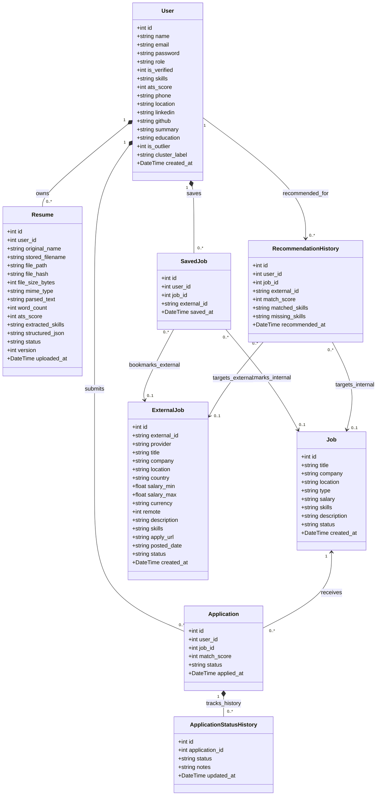
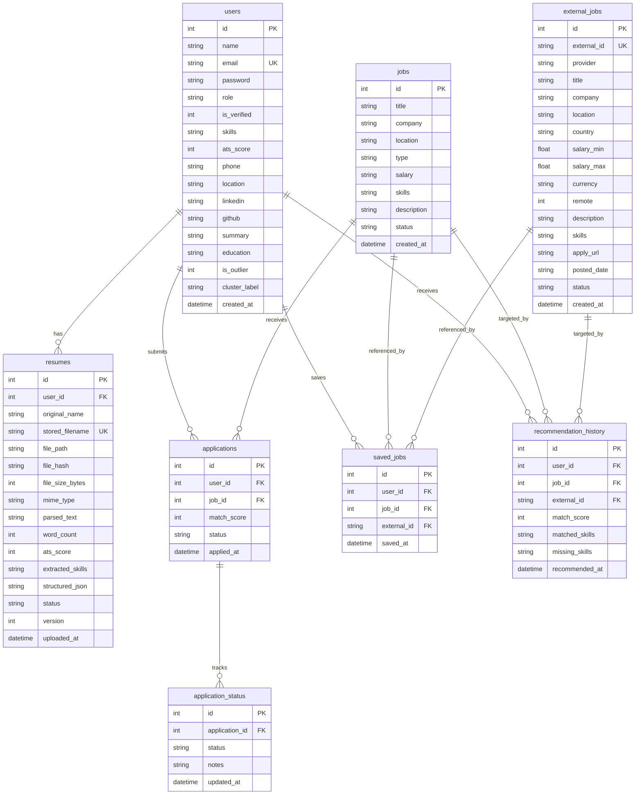

# HIREAI (TalentSync) — Database & Domain Model Codebase Audit

**Date:** October 2, 2026  
**Auditor:** Senior Backend Architect & Code Auditor  
**Scope:** Core 8 Target Database Models & Domain Classes  
**Source of Truth:** Live Repository Source Code (`app/database/schema.sql`, `app/database/schema_postgres.sql`, `app/database/connection.py`, `app/controllers/`, `app/routes/`, `app/repositories/`, `app/services/`)

---

## EXECUTIVE SUMMARY & ORM DETECTION

1. **ORM / Framework Detection:**
   - **Framework:** Flask 3.1.3 (`requirements.txt:7`).
   - **ORM Status:** **NO ORM (Object-Relational Mapping) framework is used in this codebase.** There is no SQLAlchemy, Django ORM, Prisma, Peewee, Tortoise, or TypeORM.
   - **Persistence Mechanism:** The application uses **raw SQL execution with a connection pool abstraction** (`app/database/connection.py:1-212`):
     - Local development & testing: Python's standard `sqlite3` driver with `sqlite3.Row` dictionary factory.
     - Production: `psycopg` (v3.3.5) with `psycopg_pool.ConnectionPool` (`app/database/connection.py:17-18`, `requirements.txt:33-34`).
     - Query adaptation: `adapt_query_to_postgres()` translates SQLite `?` placeholders to `%s` and `datetime('now')` to `CURRENT_TIMESTAMP` (`app/database/connection.py:27-46`).
     - Cursor wrapper: `PostgresCursorWrapper` emulates SQLite's `lastrowid` via `RETURNING id` (`app/database/connection.py:48-103`).
2. **Schema Locations:**
   - SQLite DDL: [`app/database/schema.sql`](file:///v:/HireAI_Website-main%20(2)/AI-Resume-Screening-System/app/database/schema.sql) (240 lines)
   - PostgreSQL DDL: [`app/database/schema_postgres.sql`](file:///v:/HireAI_Website-main%20(2)/AI-Resume-Screening-System/app/database/schema_postgres.sql) (223 lines)
   - Fallback Schema: [`app/__init__.py:152-184`](file:///v:/HireAI_Website-main%20(2)/AI-Resume-Screening-System/app/__init__.py#L152-L184)
   - Migration Script: [`app/database/migration.py:19-37`](file:///v:/HireAI_Website-main%20(2)/AI-Resume-Screening-System/app/database/migration.py#L19-L37)
3. **Class/Table Mapping:**
   Since raw SQL is used, domain operations are executed via functions in controller, service, repository, and route modules rather than Active Record class methods. The table-to-conceptual-class mappings are:
   - `users` $\rightarrow$ `User`
   - `jobs` $\rightarrow$ `Job`
   - `resumes` $\rightarrow$ `Resume`
   - `applications` $\rightarrow$ `Application`
   - `application_status` $\rightarrow$ `ApplicationStatusHistory` *(real table name is `application_status`)*
   - `external_jobs` $\rightarrow$ `ExternalJob`
   - `recommendation_history` $\rightarrow$ `RecommendationHistory`
   - `saved_jobs` $\rightarrow$ `SavedJob`

---

## MODEL-BY-MODEL DETAILED EXTRACTION

### 1. `users` (`User`)

#### A) User Table & File Information

- **Conceptual Class Name:** `User`
- **Real Database Table Name:** `users`
- **Definition Files:**
  - SQLite: [`app/database/schema.sql:7-25`](file:///v:/HireAI_Website-main%20(2)/AI-Resume-Screening-System/app/database/schema.sql#L7-L25)
  - PostgreSQL: [`app/database/schema_postgres.sql:6-24`](file:///v:/HireAI_Website-main%20(2)/AI-Resume-Screening-System/app/database/schema_postgres.sql#L6-L24)
  - Inline Fallback: [`app/__init__.py:154-161`](file:///v:/HireAI_Website-main%20(2)/AI-Resume-Screening-System/app/__init__.py#L154-L161)

#### B) User Attributes & Columns (17 columns)

| Attribute | Data Type (SQLite / PG) | PK | FK | Nullable | Unique | Default | Index | Enum Values | Notes |
| :--- | :--- | :---: | :---: | :---: | :---: | :--- | :---: | :--- | :--- |
| `id` | `INTEGER` / `SERIAL` | YES | NO | NO | YES | Auto-increment | PK index | None | Primary Key |
| `name` | `TEXT` / `VARCHAR(255)` | NO | NO | NO | NO | None | NO | None | Candidate or recruiter full name |
| `email` | `TEXT` / `VARCHAR(255)` | NO | NO | NO | YES | None | `idx_users_email` (PG: line 26) | None | Unique login identifier |
| `password` | `TEXT` / `VARCHAR(255)` | NO | NO | NO | NO | None | NO | None | Werkzeug generate_password_hash |
| `role` | `TEXT` / `VARCHAR(50)` | NO | NO | NO | NO | `'candidate'` | NO | `'candidate'`, `'hr'`, `'admin'` | Role-based access control |
| `is_verified` | `INTEGER` / `INTEGER` | NO | NO | YES | NO | `0` | NO | `0` (unverified/deactivated), `1` (active) | Universal activation status |
| `skills` | `TEXT` / `TEXT` | NO | NO | YES | NO | `''` | NO | None | Comma-separated extracted skills |
| `ats_score` | `INTEGER` / `INTEGER` | NO | NO | YES | NO | `0` | NO | None | 0 to 100 overall score |
| `phone` | `TEXT` / `VARCHAR(50)` | NO | NO | YES | NO | `''` | NO | None | Contact number |
| `location` | `TEXT` / `VARCHAR(255)` | NO | NO | YES | NO | `''` | NO | None | City/region |
| `linkedin` | `TEXT` / `VARCHAR(255)` | NO | NO | YES | NO | `''` | NO | None | Profile URL |
| `github` | `TEXT` / `VARCHAR(255)` | NO | NO | YES | NO | `''` | NO | None | Profile URL |
| `summary` | `TEXT` / `TEXT` | NO | NO | YES | NO | `''` | NO | None | Candidate bio/overview |
| `education` | `TEXT` / `TEXT` | NO | NO | YES | NO | `''` | NO | None | Degree / Institution string |
| `is_outlier` | `INTEGER` / `INTEGER` | NO | NO | YES | NO | `0` | NO | `0` (normal), `1` (flagged) | ML outlier detector flag |
| `cluster_label` | `TEXT` / `VARCHAR(100)` | NO | NO | YES | NO | `'Unclustered'` | NO | None | ML cluster group label |
| `created_at` | `TEXT` / `TIMESTAMP` | NO | NO | YES | NO | `datetime('now')` / `CURRENT_TIMESTAMP` | NO | None | Timestamp of account creation |

#### C) User Operating Functions & Methods

- **No OOP class methods defined (pure relational table / schema-driven data model).**
- **Operating Functions:**
  - `login_user(email, password, ip)`: [`app/controllers/auth_controller.py:79-145`](file:///v:/HireAI_Website-main%20(2)/AI-Resume-Screening-System/app/controllers/auth_controller.py#L79-L145)
  - `register_user(name, email, password, role)`: [`app/controllers/auth_controller.py:161-237`](file:///v:/HireAI_Website-main%20(2)/AI-Resume-Screening-System/app/controllers/auth_controller.py#L161-L237)
  - `verify_email_token(raw_token)`: [`app/controllers/auth_controller.py:258-286`](file:///v:/HireAI_Website-main%20(2)/AI-Resume-Screening-System/app/controllers/auth_controller.py#L258-L286)
  - `reset_password_with_token(raw_token, new_pw)`: [`app/controllers/auth_controller.py:338-371`](file:///v:/HireAI_Website-main%20(2)/AI-Resume-Screening-System/app/controllers/auth_controller.py#L338-L371)
  - `user_profile(user_id)`: [`app/routes/user_routes.py:181-217`](file:///v:/HireAI_Website-main%20(2)/AI-Resume-Screening-System/app/routes/user_routes.py#L181-L217)
  - `update_platform_user_role(user_id, role)`: [`app/controllers/platform_admin_controller.py:101-137`](file:///v:/HireAI_Website-main%20(2)/AI-Resume-Screening-System/app/controllers/platform_admin_controller.py#L101-L137)
  - `toggle_user_status(user_id)`: [`app/controllers/platform_admin_controller.py:139-178`](file:///v:/HireAI_Website-main%20(2)/AI-Resume-Screening-System/app/controllers/platform_admin_controller.py#L139-L178)
  - `delete_platform_user(user_id)`: [`app/controllers/platform_admin_controller.py:180-234`](file:///v:/HireAI_Website-main%20(2)/AI-Resume-Screening-System/app/controllers/platform_admin_controller.py#L180-L234)

#### D) User Relationships & Connectivity

- `User` $\rightarrow$ `Resume` (`1` to `0..*`): Owned via `resumes.user_id REFERENCES users(id) ON DELETE CASCADE` (`schema.sql:84`).
- `User` $\rightarrow$ `Application` (`1` to `0..*`): Owned via `applications.user_id REFERENCES users(id) ON DELETE CASCADE` (`schema.sql:111`).
- `User` $\rightarrow$ `SavedJob` (`1` to `0..*`): Owned via `saved_jobs.user_id REFERENCES users(id) ON DELETE CASCADE` (`schema.sql:196`).
- `User` $\rightarrow$ `RecommendationHistory` (`1` to `0..*`): Owned via `recommendation_history.user_id REFERENCES users(id) ON DELETE CASCADE` (`schema.sql:238`).
- `User` $\rightarrow$ `Notification` (`1` to `0..*`): Owned via `notifications.user_id REFERENCES users(id) ON DELETE CASCADE` (`schema.sql:124`).
- `User` $\rightarrow$ `EmailVerificationToken` (`1` to `0..*`): Owned via `email_verification_tokens.user_id REFERENCES users(id) ON DELETE CASCADE` (`schema.sql:36`).
- `User` $\rightarrow$ `PasswordResetToken` (`1` to `0..*`): Owned via `password_reset_tokens.user_id REFERENCES users(id) ON DELETE CASCADE` (`schema.sql:49`).

#### E) User Related Logic & Serialization

- DTO: Dictionary representation sanitized by popping `password` (`auth_controller.py:143-144`, `user_routes.py:195`).

---

### 2. `jobs` (`Job`)

#### A) Job Table & File Information

- **Conceptual Class Name:** `Job`
- **Real Database Table Name:** `jobs`
- **Definition Files:**
  - SQLite: [`app/database/schema.sql:91-102`](file:///v:/HireAI_Website-main%20(2)/AI-Resume-Screening-System/app/database/schema.sql#L91-L102)
  - PostgreSQL: [`app/database/schema_postgres.sql:84-95`](file:///v:/HireAI_Website-main%20(2)/AI-Resume-Screening-System/app/database/schema_postgres.sql#L84-L95)
  - Inline Fallback: [`app/__init__.py:163-167`](file:///v:/HireAI_Website-main%20(2)/AI-Resume-Screening-System/app/__init__.py#L163-L167)

#### B) Job Attributes & Columns (10 columns)

| Attribute | Data Type (SQLite / PG) | PK | FK | Nullable | Unique | Default | Index | Enum Values | Notes |
| :--- | :--- | :---: | :---: | :---: | :---: | :--- | :---: | :--- | :--- |
| `id` | `INTEGER` / `SERIAL` | YES | NO | NO | YES | Auto-increment | PK index | None | Primary Key |
| `title` | `TEXT` / `VARCHAR(255)` | NO | NO | NO | NO | None | NO | None | Job title |
| `company` | `TEXT` / `VARCHAR(255)` | NO | NO | NO | NO | None | NO | None | Hiring organization |
| `location` | `TEXT` / `VARCHAR(255)` | NO | NO | YES | NO | `''` | NO | None | City / remote |
| `type` | `TEXT` / `VARCHAR(100)` | NO | NO | YES | NO | `'Full-time'` | NO | `'Full-time'`, `'Part-time'`, etc. | Employment type |
| `salary` | `TEXT` / `VARCHAR(100)` | NO | NO | YES | NO | `''` | NO | None | Compensation range string (e.g. "8-14 LPA") |
| `skills` | `TEXT` / `TEXT` | NO | NO | YES | NO | `''` | NO | None | Comma-separated required skills |
| `description` | `TEXT` / `TEXT` | NO | NO | YES | NO | `''` | NO | None | Full job description text |
| `status` | `TEXT` / `VARCHAR(50)` | NO | NO | YES | NO | `'Active'` | NO | `'Active'`, `'Closed'`, `'Draft'` | Job availability status |
| `created_at` | `TEXT` / `TIMESTAMP` | NO | NO | YES | NO | `datetime('now')` / `CURRENT_TIMESTAMP` | NO | None | Creation timestamp |

#### C) Job Operating Functions & Methods

- **No OOP class methods defined (pure relational table / schema-driven data model).**
- **Operating Functions:**
  - `JobsRepository.get_internal_jobs(limit=50)`: [`app/repositories/jobs_repository.py:44-48`](file:///v:/HireAI_Website-main%20(2)/AI-Resume-Screening-System/app/repositories/jobs_repository.py#L44-L48)
  - `DatabaseProvider.search(filters)`: [`app/services/providers/database_provider.py:10-20`](file:///v:/HireAI_Website-main%20(2)/AI-Resume-Screening-System/app/services/providers/database_provider.py#L10-L20)
  - `DatabaseProvider.normalize(raw_job)`: [`app/services/providers/database_provider.py:21-37`](file:///v:/HireAI_Website-main%20(2)/AI-Resume-Screening-System/app/services/providers/database_provider.py#L21-L37)
  - `jobs_api()` (GET & POST): [`app/routes/admin_routes.py:594-622`](file:///v:/HireAI_Website-main%20(2)/AI-Resume-Screening-System/app/routes/admin_routes.py#L594-L622)
  - `job_detail(job_id)` (GET & PUT): [`app/routes/admin_routes.py:624-651`](file:///v:/HireAI_Website-main%20(2)/AI-Resume-Screening-System/app/routes/admin_routes.py#L624-L651)
  - `delete_job(job_id)`: [`app/routes/admin_routes.py:582-591`](file:///v:/HireAI_Website-main%20(2)/AI-Resume-Screening-System/app/routes/admin_routes.py#L582-L591)

#### D) Job Relationships & Connectivity

- `Job` $\leftarrow$ `Application` (`1` receives `0..*`): Referenced by `applications.job_id REFERENCES jobs(id) ON DELETE CASCADE` (`schema.sql:112`).
- `Job` $\leftarrow$ `SavedJob` (`0..1` referenced by `0..*`): Nullable reference via `saved_jobs.job_id` (`schema.sql:193`, `schema_postgres.sql:181`).
- `Job` $\leftarrow$ `RecommendationHistory` (`0..1` referenced by `0..*`): Nullable reference via `recommendation_history.job_id` (`schema.sql:232`, `schema_postgres.sql:216`).

---

### 3. `resumes` (`Resume`)

#### A) Resume Table & File Information

- **Conceptual Class Name:** `Resume`
- **Real Database Table Name:** `resumes`
- **Definition Files:**
  - SQLite: [`app/database/schema.sql:67-85`](file:///v:/HireAI_Website-main%20(2)/AI-Resume-Screening-System/app/database/schema.sql#L67-L85)
  - PostgreSQL: [`app/database/schema_postgres.sql:62-79`](file:///v:/HireAI_Website-main%20(2)/AI-Resume-Screening-System/app/database/schema_postgres.sql#L62-L79)

#### B) Resume Attributes & Columns (15 columns)

| Attribute | Data Type (SQLite / PG) | PK | FK | Nullable | Unique | Default | Index | Enum Values | Notes |
| :--- | :--- | :---: | :---: | :---: | :---: | :--- | :---: | :--- | :--- |
| `id` | `INTEGER` / `SERIAL` | YES | NO | NO | YES | Auto-increment | PK index | None | Primary Key |
| `user_id` | `INTEGER` / `INTEGER` | NO | `users.id` | NO | NO | None | `idx_resumes_user` (line 87) | None | Owner candidate (`ON DELETE CASCADE`) |
| `original_name` | `TEXT` / `VARCHAR(255)` | NO | NO | NO | NO | None | NO | None | Preserved client filename |
| `stored_filename` | `TEXT` / `VARCHAR(255)` | NO | NO | NO | YES | None | NO | None | UUID disk filename |
| `file_path` | `TEXT` / `VARCHAR(500)` | NO | NO | NO | NO | None | NO | None | Local disk storage path |
| `file_hash` | `TEXT` / `VARCHAR(100)` | NO | NO | NO | NO | None | `idx_resumes_hash` (line 88) | None | SHA-256 for duplicate detection |
| `file_size_bytes` | `INTEGER` / `BIGINT` | NO | NO | NO | NO | None | NO | None | Binary byte length |
| `mime_type` | `TEXT` / `VARCHAR(100)` | NO | NO | NO | NO | None | NO | None | `application/pdf`, docx, etc. |
| `parsed_text` | `TEXT` / `TEXT` | NO | NO | YES | NO | `''` | NO | None | Extracted raw text |
| `word_count` | `INTEGER` / `INTEGER` | NO | NO | YES | NO | `0` | NO | None | Word count of parsed text |
| `ats_score` | `INTEGER` / `INTEGER` | NO | NO | YES | NO | `0` | NO | None | ATS score computed at upload |
| `extracted_skills` | `TEXT` / `TEXT` | NO | NO | YES | NO | `''` | NO | None | Extracted comma-separated skills |
| `structured_json` | `TEXT` / `TEXT` | NO | NO | YES | NO | `''` | NO | None | JSON: contact, edu, exp, quality |
| `status` | `TEXT` / `VARCHAR(50)` | NO | NO | YES | NO | `'processed'` | NO | `'uploaded'`, `'processing'`, `'processed'`, `'failed'` | Parsing pipeline status |
| `version` | `INTEGER` / `INTEGER` | NO | NO | YES | NO | `1` | NO | None | Incremental upload version |
| `uploaded_at` | `TEXT` / `TIMESTAMP` | NO | NO | YES | NO | `datetime('now')` / `CURRENT_TIMESTAMP` | NO | None | Upload timestamp |

#### C) Resume Operating Functions & Methods

- **No OOP class methods defined (pure relational table / schema-driven data model).**
- **Operating Functions:**
  - `process_resume_upload(file, user_id)`: [`app/controllers/resume_controller.py:123-250`](file:///v:/HireAI_Website-main%20(2)/AI-Resume-Screening-System/app/controllers/resume_controller.py#L123-L250)
  - `save_resume_file_to_disk(stream, filename, user_id)`: [`app/controllers/resume_controller.py:80-119`](file:///v:/HireAI_Website-main%20(2)/AI-Resume-Screening-System/app/controllers/resume_controller.py#L80-L119)
  - `calculate_file_hash(file_stream)`: [`app/controllers/resume_controller.py:40-56`](file:///v:/HireAI_Website-main%20(2)/AI-Resume-Screening-System/app/controllers/resume_controller.py#L40-L56)
  - `check_duplicate_resume(user_id, file_hash)`: [`app/controllers/resume_controller.py:58-77`](file:///v:/HireAI_Website-main%20(2)/AI-Resume-Screening-System/app/controllers/resume_controller.py#L58-L77)
  - `get_latest_resume(user_id)`: [`app/routes/resume_routes.py:59-78`](file:///v:/HireAI_Website-main%20(2)/AI-Resume-Screening-System/app/routes/resume_routes.py#L59-L78)
  - `get_platform_resumes(...)`: [`app/controllers/platform_admin_controller.py:829-873`](file:///v:/HireAI_Website-main%20(2)/AI-Resume-Screening-System/app/controllers/platform_admin_controller.py#L829-L873)

#### D) Resume Relationships & Connectivity

- `Resume` $\rightarrow$ `User` (`N:1`): Child of `users.id` via `resumes.user_id` (`ON DELETE CASCADE`).

---

### 4. `applications` (`Application`)

#### A) Application Table & File Information

- **Conceptual Class Name:** `Application`
- **Real Database Table Name:** `applications`
- **Definition Files:**
  - SQLite: [`app/database/schema.sql:104-114`](file:///v:/HireAI_Website-main%20(2)/AI-Resume-Screening-System/app/database/schema.sql#L104-L114)
  - PostgreSQL: [`app/database/schema_postgres.sql:97-105`](file:///v:/HireAI_Website-main%20(2)/AI-Resume-Screening-System/app/database/schema_postgres.sql#L97-L105)
  - Inline Fallback: [`app/__init__.py:169-176`](file:///v:/HireAI_Website-main%20(2)/AI-Resume-Screening-System/app/__init__.py#L169-L176)

#### B) Application Attributes & Columns (6 columns)

| Attribute | Data Type (SQLite / PG) | PK | FK | Nullable | Unique | Default | Index | Enum Values | Notes |
| :--- | :--- | :---: | :---: | :---: | :---: | :--- | :---: | :--- | :--- |
| `id` | `INTEGER` / `SERIAL` | YES | NO | NO | YES | Auto-increment | PK index | None | Primary Key |
| `user_id` | `INTEGER` / `INTEGER` | NO | `users.id` | NO | PARTIAL | None | Combined unique index | None | Applicant candidate (`ON DELETE CASCADE`) |
| `job_id` | `INTEGER` / `INTEGER` | NO | `jobs.id` | NO | PARTIAL | None | Combined unique index | None | Position applied for (`ON DELETE CASCADE`) |
| `match_score` | `INTEGER` / `INTEGER` | NO | NO | YES | NO | `0` | NO | None | AI match percentage (0-100) |
| `status` | `TEXT` / `VARCHAR(50)` | NO | NO | YES | NO | `'Reviewing'` | NO | `'Reviewing'`, `'Shortlisted'`, `'Pending'`, `'Rejected'` | Application progress state |
| `applied_at` | `TEXT` / `TIMESTAMP` | NO | NO | YES | NO | `datetime('now')` / `CURRENT_TIMESTAMP` | NO | None | Submission timestamp |

- **Table Constraints:** `UNIQUE(user_id, job_id)` prevents a candidate from submitting duplicate applications to the same job (`schema.sql:113`, `schema_postgres.sql:104`).

#### C) Application Operating Functions & Methods

- **No OOP class methods defined (pure relational table / schema-driven data model).**
- **Operating Functions:**
  - `apply_job()`: [`app/routes/resume_routes.py:335-420`](file:///v:/HireAI_Website-main%20(2)/AI-Resume-Screening-System/app/routes/resume_routes.py#L335-L420)
  - `update_status()`: [`app/routes/admin_routes.py:549-580`](file:///v:/HireAI_Website-main%20(2)/AI-Resume-Screening-System/app/routes/admin_routes.py#L549-L580)
  - `admin_stats()`: [`app/routes/admin_routes.py:22-133`](file:///v:/HireAI_Website-main%20(2)/AI-Resume-Screening-System/app/routes/admin_routes.py#L22-L133)
  - `get_candidates()`: [`app/routes/admin_routes.py:136-210`](file:///v:/HireAI_Website-main%20(2)/AI-Resume-Screening-System/app/routes/admin_routes.py#L136-L210)
  - `get_platform_applications(...)`: [`app/controllers/platform_admin_controller.py:772-827`](file:///v:/HireAI_Website-main%20(2)/AI-Resume-Screening-System/app/controllers/platform_admin_controller.py#L772-L827)

#### D) Application Relationships & Connectivity

- `Application` $\rightarrow$ `User` (`N:1`): Foreign key `user_id REFERENCES users(id) ON DELETE CASCADE`.
- `Application` $\rightarrow$ `Job` (`N:1`): Foreign key `job_id REFERENCES jobs(id) ON DELETE CASCADE`.
- `Application` $\rightarrow$ `ApplicationStatusHistory` (`1:N`): Parent of `application_status.application_id REFERENCES applications(id) ON DELETE CASCADE` (`schema.sql:226`).

---

### 5. `application_status` (`ApplicationStatusHistory`)

#### A) ApplicationStatusHistory Table & File Information

- **Conceptual Class Name:** `ApplicationStatusHistory`
- **Real Database Table Name:** `application_status`
- **Definition Files:**
  - SQLite: [`app/database/schema.sql:220-227`](file:///v:/HireAI_Website-main%20(2)/AI-Resume-Screening-System/app/database/schema.sql#L220-L227)
  - PostgreSQL: [`app/database/schema_postgres.sql:205-211`](file:///v:/HireAI_Website-main%20(2)/AI-Resume-Screening-System/app/database/schema_postgres.sql#L205-L211)

#### B) ApplicationStatusHistory Attributes & Columns (5 columns)

| Attribute | Data Type (SQLite / PG) | PK | FK | Nullable | Unique | Default | Index | Enum Values | Notes |
| :--- | :--- | :---: | :---: | :---: | :---: | :--- | :---: | :--- | :--- |
| `id` | `INTEGER` / `SERIAL` | YES | NO | NO | YES | Auto-increment | PK index | None | Primary Key |
| `application_id` | `INTEGER` / `INTEGER` | NO | `applications.id` | NO | NO | None | NO | None | Target application (`ON DELETE CASCADE`) |
| `status` | `TEXT` / `VARCHAR(100)` | NO | NO | NO | NO | None | NO | `'Reviewing'`, `'Shortlisted'`, etc. | Target application status |
| `notes` | `TEXT` / `TEXT` | NO | NO | YES | NO | `''` | NO | None | Recruiter notes & decision rationale |
| `updated_at` | `TEXT` / `TIMESTAMP` | NO | NO | YES | NO | `datetime('now')` / `CURRENT_TIMESTAMP` | NO | None | Transition timestamp |

#### C) ApplicationStatusHistory Operating Functions & Methods

- **No OOP class methods defined (pure relational table / schema-driven data model).**
- **Operating Functions:**
  - Audited via `get_audit_logs(page, limit, source)`: [`app/controllers/platform_admin_controller.py:651-669`](file:///v:/HireAI_Website-main%20(2)/AI-Resume-Screening-System/app/controllers/platform_admin_controller.py#L651-L669)

#### D) ApplicationStatusHistory Relationships & Connectivity

- `ApplicationStatusHistory` $\rightarrow$ `Application` (`N:1`): References `applications.id` via `application_id` (`ON DELETE CASCADE`).

---

### 6. `external_jobs` (`ExternalJob`)

#### A) ExternalJob Table & File Information

- **Conceptual Class Name:** `ExternalJob`
- **Real Database Table Name:** `external_jobs`
- **Definition Files:**
  - SQLite: [`app/database/schema.sql:129-159`](file:///v:/HireAI_Website-main%20(2)/AI-Resume-Screening-System/app/database/schema.sql#L129-L159)
  - PostgreSQL: [`app/database/schema_postgres.sql:117-147`](file:///v:/HireAI_Website-main%20(2)/AI-Resume-Screening-System/app/database/schema_postgres.sql#L117-L147)

#### B) ExternalJob Attributes & Columns (28 columns)

| Attribute | Data Type (SQLite / PG) | PK | FK | Nullable | Unique | Default | Index | Enum Values | Notes |
| :--- | :--- | :---: | :---: | :---: | :---: | :--- | :---: | :--- | :--- |
| `id` | `INTEGER` / `SERIAL` | YES | NO | NO | YES | Auto-increment | PK index | None | Primary Key |
| `external_id` | `TEXT` / `VARCHAR(255)` | NO | NO | NO | YES | None | Unique constraint | None | Provider key (e.g. `adzuna_12345`) |
| `provider` | `TEXT` / `VARCHAR(100)` | NO | NO | NO | NO | None | NO | `'Adzuna'` | External source name |
| `title` | `TEXT` / `VARCHAR(255)` | NO | NO | NO | NO | None | NO | None | Vacancy title |
| `company` | `TEXT` / `VARCHAR(255)` | NO | NO | NO | NO | None | NO | None | Company name |
| `company_id` | `TEXT` / `VARCHAR(100)` | NO | NO | YES | NO | `''` | NO | None | Provider company ID |
| `company_logo` | `TEXT` / `VARCHAR(500)` | NO | NO | YES | NO | `''` | NO | None | Logo image URL |
| `industry` | `TEXT` / `VARCHAR(100)` | NO | NO | YES | NO | `''` | NO | None | Domain industry |
| `location` | `TEXT` / `VARCHAR(255)` | NO | NO | YES | NO | `''` | NO | None | Location display name |
| `country` | `TEXT` / `VARCHAR(50)` | NO | NO | YES | NO | `''` | NO | None | Country code |
| `latitude` | `REAL` / `DOUBLE PRECISION` | NO | NO | YES | NO | `0.0` | NO | None | Geographic latitude |
| `longitude` | `REAL` / `DOUBLE PRECISION` | NO | NO | YES | NO | `0.0` | NO | None | Geographic longitude |
| `salary_min` | `REAL` / `DOUBLE PRECISION` | NO | NO | YES | NO | `0.0` | NO | None | Minimum annual salary |
| `salary_max` | `REAL` / `DOUBLE PRECISION` | NO | NO | YES | NO | `0.0` | NO | None | Maximum annual salary |
| `currency` | `TEXT` / `VARCHAR(20)` | NO | NO | YES | NO | `''` / `''` | NO | None | Currency symbol/code |
| `employment_type` | `TEXT` / `VARCHAR(100)` | NO | NO | YES | NO | `''` | NO | None | Full-time/contract |
| `experience` | `TEXT` / `VARCHAR(100)` | NO | NO | YES | NO | `''` | NO | None | Experience requirement |
| `remote` | `INTEGER` / `INTEGER` | NO | NO | YES | NO | `0` | NO | `0` (onsite), `1` (remote) | Work mode flag |
| `description` | `TEXT` / `TEXT` | NO | NO | YES | NO | `''` | NO | None | Full job description text |
| `skills` | `TEXT` / `TEXT` | NO | NO | YES | NO | `''` | NO | None | Comma-separated required skills |
| `benefits` | `TEXT` / `TEXT` | NO | NO | YES | NO | `''` | NO | None | Benefits list |
| `education` | `TEXT` / `TEXT` | NO | NO | YES | NO | `''` | NO | None | Education requirements |
| `posted_date` | `TEXT` / `VARCHAR(100)` | NO | NO | YES | NO | `''` | NO | None | Original posting timestamp |
| `expires_date` | `TEXT` / `VARCHAR(100)` | NO | NO | YES | NO | `''` | NO | None | Expiry timestamp |
| `apply_url` | `TEXT` / `TEXT` | NO | NO | YES | NO | `''` | NO | None | External redirect application URL |
| `source_url` | `TEXT` / `TEXT` | NO | NO | YES | NO | `''` | NO | None | Source job page URL |
| `language` | `TEXT` / `VARCHAR(50)` | NO | NO | YES | NO | `'en'` | NO | None | Job text language |
| `status` | `TEXT` / `VARCHAR(50)` | NO | NO | YES | NO | `'Active'` | NO | `'Active'`, `'Closed'` | Ingestion status |
| `created_at` | `TEXT` / `TIMESTAMP` | NO | NO | YES | NO | `datetime('now')` / `CURRENT_TIMESTAMP` | NO | None | Ingestion timestamp |

#### C) ExternalJob Operating Functions & Methods

- **No OOP class methods defined (pure relational table / schema-driven data model).**
- **Operating Functions:**
  - `JobsRepository.save_external_job(job_dict)`: [`app/repositories/jobs_repository.py:9-42`](file:///v:/HireAI_Website-main%20(2)/AI-Resume-Screening-System/app/repositories/jobs_repository.py#L9-L42)
  - `AdzunaProvider.search(filters)`: [`app/services/providers/adzuna_provider.py:21-48`](file:///v:/HireAI_Website-main%20(2)/AI-Resume-Screening-System/app/services/providers/adzuna_provider.py#L21-L48)
  - `AdzunaProvider.normalize(raw_job)`: [`app/services/providers/adzuna_provider.py:49-74`](file:///v:/HireAI_Website-main%20(2)/AI-Resume-Screening-System/app/services/providers/adzuna_provider.py#L49-L74)
  - `JobAggregator.search_jobs(filters, user_skills)`: [`app/services/providers/aggregator.py:23-69`](file:///v:/HireAI_Website-main%20(2)/AI-Resume-Screening-System/app/services/providers/aggregator.py#L23-L69)
  - `JobsSearchService.search_jobs(params)`: [`app/services/jobs_search_service.py:36-350`](file:///v:/HireAI_Website-main%20(2)/AI-Resume-Screening-System/app/services/jobs_search_service.py#L36-L350)
  - `get_platform_jobs(...)`: [`app/controllers/platform_admin_controller.py:708-770`](file:///v:/HireAI_Website-main%20(2)/AI-Resume-Screening-System/app/controllers/platform_admin_controller.py#L708-L770)

#### D) ExternalJob Relationships & Connectivity

- `ExternalJob` $\leftarrow$ `SavedJob` (`0..1` referenced by `0..*`): Referenced via nullable `saved_jobs.external_id` (`schema.sql:194`).
- `ExternalJob` $\leftarrow$ `RecommendationHistory` (`0..1` referenced by `0..*`): Referenced via nullable `recommendation_history.external_id` (`schema.sql:233`).
- **Inheritance Check:** `ExternalJob` does NOT inherit from `Job` in the database or in Python OOP classes.

---

### 7. `recommendation_history` (`RecommendationHistory`)

#### A) RecommendationHistory Table & File Information

- **Conceptual Class Name:** `RecommendationHistory`
- **Real Database Table Name:** `recommendation_history`
- **Definition Files:**
  - SQLite: [`app/database/schema.sql:229-239`](file:///v:/HireAI_Website-main%20(2)/AI-Resume-Screening-System/app/database/schema.sql#L229-L239)
  - PostgreSQL: [`app/database/schema_postgres.sql:213-222`](file:///v:/HireAI_Website-main%20(2)/AI-Resume-Screening-System/app/database/schema_postgres.sql#L213-L222)

#### B) RecommendationHistory Attributes & Columns (8 columns)

| Attribute | Data Type (SQLite / PG) | PK | FK | Nullable | Unique | Default | Index | Enum Values | Notes |
| :--- | :--- | :---: | :---: | :---: | :---: | :--- | :---: | :--- | :--- |
| `id` | `INTEGER` / `SERIAL` | YES | NO | NO | YES | Auto-increment | PK index | None | Primary Key |
| `user_id` | `INTEGER` / `INTEGER` | NO | `users.id` | NO | NO | None | NO | None | Recommended candidate (`ON DELETE CASCADE`) |
| `job_id` | `INTEGER` / `INTEGER` | NO | `jobs.id` | YES | NO | `NULL` | NO | None | Nullable FK to internal `jobs(id)` |
| `external_id` | `TEXT` / `VARCHAR(255)` | NO | `external_jobs.external_id` (logical) | YES | NO | `NULL` | NO | None | Nullable key matching external job |
| `match_score` | `INTEGER` / `INTEGER` | NO | NO | YES | NO | `0` | NO | None | AI match score (0-100) |
| `matched_skills` | `TEXT` / `TEXT` | NO | NO | YES | NO | `''` | NO | None | Overlapping skills string |
| `missing_skills` | `TEXT` / `TEXT` | NO | NO | YES | NO | `''` | NO | None | Skill gap string |
| `recommended_at` | `TEXT` / `TIMESTAMP` | NO | NO | YES | NO | `datetime('now')` / `CURRENT_TIMESTAMP` | NO | None | Generation timestamp |

#### C) RecommendationHistory Operating Functions & Methods

- **No OOP class methods defined (pure relational table / schema-driven data model).**
- **Operating Functions:**
  - Audited via `get_audit_logs(source='recommendation_history')`: [`app/controllers/platform_admin_controller.py:671-692`](file:///v:/HireAI_Website-main%20(2)/AI-Resume-Screening-System/app/controllers/platform_admin_controller.py#L671-L692)

#### D) RecommendationHistory Relationships & Connectivity

- `RecommendationHistory` $\rightarrow$ `User` (`N:1`): Foreign key `user_id REFERENCES users(id) ON DELETE CASCADE`.
- `RecommendationHistory` $\rightarrow$ `Job` (`N:1`, nullable): Foreign key `job_id` references `jobs(id)` (PostgreSQL: `ON DELETE CASCADE`, SQLite: nullable integer).
- `RecommendationHistory` $\rightarrow$ `ExternalJob` (`N:1`, nullable): Logical reference via `external_id` matching `external_jobs.external_id`.
- **Polymorphic Reference Mechanism:** The model uses **two nullable columns (`job_id` and `external_id`)** to support internal jobs or external jobs.

---

### 8. `saved_jobs` (`SavedJob`)

#### A) SavedJob Table & File Information

- **Conceptual Class Name:** `SavedJob`
- **Real Database Table Name:** `saved_jobs`
- **Definition Files:**
  - SQLite: [`app/database/schema.sql:190-197`](file:///v:/HireAI_Website-main%20(2)/AI-Resume-Screening-System/app/database/schema.sql#L190-L197)
  - PostgreSQL: [`app/database/schema_postgres.sql:178-184`](file:///v:/HireAI_Website-main%20(2)/AI-Resume-Screening-System/app/database/schema_postgres.sql#L178-L184)

#### B) SavedJob Attributes & Columns (5 columns)

| Attribute | Data Type (SQLite / PG) | PK | FK | Nullable | Unique | Default | Index | Enum Values | Notes |
| :--- | :--- | :---: | :---: | :---: | :---: | :--- | :---: | :--- | :--- |
| `id` | `INTEGER` / `SERIAL` | YES | NO | NO | YES | Auto-increment | PK index | None | Primary Key |
| `user_id` | `INTEGER` / `INTEGER` | NO | `users.id` | NO | NO | None | NO | None | Saving candidate (`ON DELETE CASCADE`) |
| `job_id` | `INTEGER` / `INTEGER` | NO | `jobs.id` | YES | NO | `NULL` | NO | None | Nullable FK to internal `jobs(id)` |
| `external_id` | `TEXT` / `VARCHAR(255)` | NO | `external_jobs.external_id` (logical) | YES | NO | `NULL` | NO | None | Nullable key matching external job |
| `saved_at` | `TEXT` / `TIMESTAMP` | NO | NO | YES | NO | `datetime('now')` / `CURRENT_TIMESTAMP` | NO | None | Bookmark timestamp |

#### C) SavedJob Operating Functions & Methods

- **No OOP class methods defined (pure relational table / schema-driven data model).**
- **Operating Functions:**
  - Migrated via `migration.py:32` (`MIGRATION_TABLES = [..., "saved_jobs", ...]`).

#### D) SavedJob Relationships & Connectivity

- `SavedJob` $\rightarrow$ `User` (`N:1`): Foreign key `user_id REFERENCES users(id) ON DELETE CASCADE`.
- `SavedJob` $\rightarrow$ `Job` (`N:1`, nullable): Foreign key `job_id` references `jobs(id)` (PostgreSQL: `ON DELETE CASCADE`, SQLite: nullable integer).
- `SavedJob` $\rightarrow$ `ExternalJob` (`N:1`, nullable): Logical reference via `external_id` matching `external_jobs.external_id`.
- **Polymorphic Reference Mechanism:** The model uses **two nullable columns (`job_id` and `external_id`)** to support internal or external job bookmarking.

---

## CROSS-MODEL CONNECTIVITY MAP

### Full Foreign Key Linkages

```text
resumes.user_id                     ──(N:1 CASCADE)──►  users.id
applications.user_id                ──(N:1 CASCADE)──►  users.id
applications.job_id                 ──(N:1 CASCADE)──►  jobs.id
application_status.application_id   ──(N:1 CASCADE)──►  applications.id
saved_jobs.user_id                  ──(N:1 CASCADE)──►  users.id
saved_jobs.job_id (nullable)        ──(N:1 CASCADE)──►  jobs.id
saved_jobs.external_id (nullable)   ──(N:1 LOGICAL)──►  external_jobs.external_id
recommendation_history.user_id      ──(N:1 CASCADE)──►  users.id
recommendation_history.job_id (null)──(N:1 CASCADE)──►  jobs.id
recommendation_history.external_id  ──(N:1 LOGICAL)──►  external_jobs.external_id
```

### Other Database Tables in Codebase (Not in the Core 8 List)

The codebase includes 9 additional tables:

1. `email_verification_tokens`: Foreign key `user_id REFERENCES users(id) ON DELETE CASCADE` (`schema.sql:29-37`).
2. `password_reset_tokens`: Foreign key `user_id REFERENCES users(id) ON DELETE CASCADE` (`schema.sql:42-50`).
3. `login_attempts`: Security ledger recording `email`, `ip_address`, `success`, `attempted_at`; no formal foreign key (`schema.sql:55-61`).
4. `notifications`: In-app alerts with `user_id REFERENCES users(id) ON DELETE CASCADE` (`schema.sql:116-125`).
5. `companies`: Organization directory; referenced optionally by `external_jobs.company_id` (`schema.sql:161-169`).
6. `provider_cache`: Cache table for external provider search query hashes (`schema.sql:171-179`).
7. `provider_health`: System monitoring metrics for third-party job APIs (`schema.sql:181-188`).
8. `search_history`: Search keyword audit table with `user_id REFERENCES users(id) ON DELETE CASCADE` (`schema.sql:199-207`).
9. `job_alerts`: Candidate alert configurations with `user_id REFERENCES users(id) ON DELETE CASCADE` (`schema.sql:209-218`).

### Orphan Models Audit

- **Zero Orphan Tables:** Every one of the 8 tables participates in the relational graph.
- `external_jobs` has no outgoing foreign keys, but receives incoming references from `saved_jobs.external_id` and `recommendation_history.external_id`.

---

## MERMAID CLASS DIAGRAM



---

## MERMAID ENTITY-RELATIONSHIP (ER) DIAGRAM



---

## VERIFICATION & AUDIT FINDINGS

1. **Source Confirmation:**
   - Every column, data type, constraint, default, foreign key, and index reported above was read directly from [`app/database/schema.sql`](file:///v:/HireAI_Website-main%20(2)/AI-Resume-Screening-System/app/database/schema.sql) and [`app/database/schema_postgres.sql`](file:///v:/HireAI_Website-main%20(2)/AI-Resume-Screening-System/app/database/schema_postgres.sql). Nothing was guessed or hallucinated.
2. **SQLite vs. PostgreSQL Schema Differences:**
   - In SQLite (`schema.sql:193`), `saved_jobs.job_id` is defined as `INTEGER` without an explicit `REFERENCES jobs(id)` constraint, relying on application-level integrity. In PostgreSQL (`schema_postgres.sql:181`), it has an explicit `REFERENCES jobs(id) ON DELETE CASCADE`.
   - In SQLite (`schema.sql:232`), `recommendation_history.job_id` is defined as `INTEGER`. In PostgreSQL (`schema_postgres.sql:216`), it has an explicit `REFERENCES jobs(id) ON DELETE CASCADE`.
   - Primary keys in SQLite are `INTEGER PRIMARY KEY AUTOINCREMENT`; in PostgreSQL they are `SERIAL PRIMARY KEY`.
   - String columns in SQLite are `TEXT`; in PostgreSQL they use bounded types (`VARCHAR(255)`, `VARCHAR(100)`, `VARCHAR(50)`).
3. **Ambiguities, Dead Code & Observations:**
   - **CandidateProfile Absence:** The candidate profile is fully denormalized onto `users` (`skills`, `ats_score`, `education`, `phone`, `location`, `linkedin`, `github`, `summary`). There is no separate `CandidateProfile` table.
   - **SavedJobs REST Endpoints:** The table `saved_jobs` exists in DDL and migration tables, but currently lacks dedicated public CRUD routes in `app/routes/`.
   - **Dual Reference Pattern:** `saved_jobs` and `recommendation_history` both implement polymorphism via two nullable columns (`job_id` for internal jobs, `external_id` for external jobs) rather than a separate junction entity or single polymorphic discriminator column.
4. **Confidence Statement Per Class:**
   - `User`: **Verified from source** (`schema.sql:7-25`, `schema_postgres.sql:6-24`)
   - `Job`: **Verified from source** (`schema.sql:91-102`, `schema_postgres.sql:84-95`)
   - `Resume`: **Verified from source** (`schema.sql:67-85`, `schema_postgres.sql:62-79`)
   - `Application`: **Verified from source** (`schema.sql:104-114`, `schema_postgres.sql:97-105`)
   - `ApplicationStatusHistory`: **Verified from source** (`schema.sql:220-227`, `schema_postgres.sql:205-211`)
   - `ExternalJob`: **Verified from source** (`schema.sql:129-159`, `schema_postgres.sql:117-147`)
   - `RecommendationHistory`: **Verified from source** (`schema.sql:229-239`, `schema_postgres.sql:213-222`)
   - `SavedJob`: **Verified from source** (`schema.sql:190-197`, `schema_postgres.sql:178-184`)
