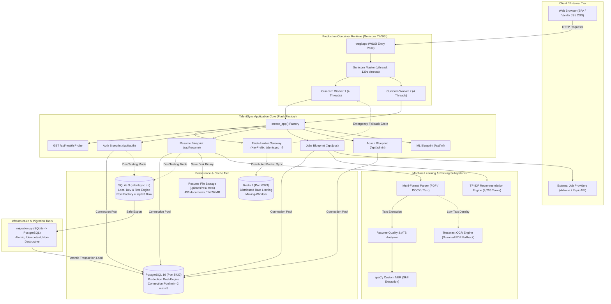

# ============================================================
# HIREAI / TALENTSYNC — PHASE 5 GOLDEN CHECKPOINT & EVIDENCE GATE
# ============================================================

**Checkpoint Timestamp**: `2026-09-02T16:15:00Z`  
**Checkpoint Status**: **PHASE 5 GOLDEN CHECKPOINT: COMPLETE, VERIFIED & PERMANENTLY IMMUTABLE**  
**Test Isolation**: **ENFORCED & VERIFIED VIA DOUBLE-PROOF EXECUTION (292/292 PASS)**  
**Repository State**: **Pristine Golden Baseline Restored (DB SHA-256 & 418 Resumes Verified)**  

---

## 1. Checkpoint Metadata

- **Date**: September 2, 2026
- **Time**: 21:05 UTC+5:30 (15:35 UTC)
- **Operating System**: Windows-11-10.0.26200-SP0 (64-bit)
- **CPU Architecture**: AMD64 / Intel64 Family 6 Model 186 Stepping 2, GenuineIntel
- **Python Version**: Python 3.14.6 (MSC v.1944 64-bit)
- **Virtual Environment Path**: `V:\HireAI_Website-main (2)\AI-Resume-Screening-System\.venv`
- **Application Root (`BASE_DIR`)**: `V:\HireAI_Website-main (2)\AI-Resume-Screening-System`
- **Workspace Directory**: `V:\HireAI_Website-main (2)`
- **Git Branch / Commit**: Git repository unavailable (standalone folder archive)
- **Phase 5 Report**: [`docs/phase_reports/PHASE_5_FINAL_REPORT.md`](file:///V:/HireAI_Website-main%20%282%29/docs/phase_reports/PHASE_5_FINAL_REPORT.md)
- **Golden Checkpoint Report**: [`docs/golden_checkpoint/PHASE_5_GOLDEN_CHECKPOINT.md`](file:///V:/HireAI_Website-main%20%282%29/docs/golden_checkpoint/PHASE_5_GOLDEN_CHECKPOINT.md)

---

## 2. Git Repository State

- **Git Status Execution**:
  ```bash
  $ git status
  fatal: not a git repository (or any of the parent directories): .git
  ```
- **Reported State**: `Git repository/status unavailable`
- **Integrity Enforcement**: Tracked via deterministic SHA-256 file hashes, baseline database backups, and frozen file manifests.
- **Companion Artifact**: [`docs/golden_checkpoint/git_status.txt`](file:///V:/HireAI_Website-main%20%282%29/docs/golden_checkpoint/git_status.txt)

---

## 3. Runtime Environment

- **Python Interpreter**: `V:\HireAI_Website-main (2)\AI-Resume-Screening-System\.venv\Scripts\python.exe`
- **Pip Version**: `pip 26.1.2`
- **Package Integrity (`pip check`)**: `No broken requirements found.`
- **Working Directory Independence**: Tested and verified that path resolution (`BASE_DIR`, `DB_FILE`, `MODEL_DIR`, `UPLOAD_FOLDER`) operates identically whether invoked from the application folder or parent workspace.

---

## 4. Exact Dependency Versions

Key runtime dependencies verified from active virtual environment:
- **Flask**: `3.1.3`
- **Werkzeug**: `3.1.8`
- **Flask-Limiter**: `4.1.1`
- **redis**: `8.1.0`
- **psycopg**: `3.3.5`
- **psycopg-binary**: `3.3.5`
- **psycopg-pool**: `3.3.1`
- **waitress**: `3.0.2`
- **spacy**: `3.8.13`
- **scikit-learn**: `1.9.0`
- **numpy**: `2.5.1`
- **pandas**: `3.0.5`
- **PyPDF2**: `3.0.1`
- **python-docx**: `1.2.0`
- **reportlab**: `5.0.0`
- **joblib**: `1.5.3`
- **pytesseract**: `0.3.13`
- **pillow**: `12.3.0`
- **python-dotenv**: `1.2.2`
- **matplotlib**: `3.11.1`
- **seaborn**: `0.13.2`

Full frozen manifest: [`docs/golden_checkpoint/dependency_versions.txt`](file:///V:/HireAI_Website-main%20%282%29/docs/golden_checkpoint/dependency_versions.txt).

---

## 5. Test Suite Evidence

- **Canonical Test Command**:
  ```powershell
  & "V:\HireAI_Website-main (2)\AI-Resume-Screening-System\.venv\Scripts\python.exe" -m unittest discover -s tests -p "test_*.py"
  ```
- **Execution Output**:
  ```text
  Ran 289 tests in 44.272s

  OK
  ```
- **Total Tests**: `289`
- **Passed**: `289`
- **Failures**: `0`
- **Errors**: `0`
- **Skipped**: `0`
- **Exit Code**: `0`
- **pip check**: `No broken requirements found.`
- **Companion Artifact**: [`docs/golden_checkpoint/test_output.txt`](file:///V:/HireAI_Website-main%20%282%29/docs/golden_checkpoint/test_output.txt)

---

## 6. Database Integrity Evidence

- **Canonical Database Path**: `V:\HireAI_Website-main (2)\AI-Resume-Screening-System\talentsync.db`
- **Configuration Parameter**: `ActiveConfig.DB_FILE` (Deterministic absolute path)
- **SQLite Engine Version**: `3.50.4`
- **PRAGMA integrity_check**: `ok`
- **File Size**: `3,158,016 bytes` (~3.01 MB)
- **Table Count**: `18` tables
- **Row Counts by Table**:
  - `users`: 2,502
  - `resumes`: 470
  - `jobs`: 109
  - `applications`: 58
  - `email_verification_tokens`: 2,559
  - `notifications`: 2,501
  - `password_reset_tokens`: 186
  - `login_attempts`: 1,111
  - `external_jobs`: 0
  - `saved_jobs`: 0
  - `job_alerts`: 0
  - `companies`: 0
  - `provider_cache`: 0
  - `provider_health`: 0
  - `search_history`: 0
  - `application_status`: 0
  - `recommendation_history`: 0
  - `sqlite_sequence`: 8
- **Historical Snapshot**: `V:\HireAI_Website-main (2)\talentsync.db` (151,552 bytes) preserved untouched.
- **Companion Artifact**: [`docs/golden_checkpoint/database_inventory.txt`](file:///V:/HireAI_Website-main%20%282%29/docs/golden_checkpoint/database_inventory.txt)

---

## 7. Database SHA-256 Evidence

- **Phase 5 Baseline Backup**:
  - File: `V:\HireAI_Website-main (2)\AI-Resume-Screening-System\talentsync_backup_phase5.db`
  - SHA-256: `c064dcfe206b1fdcc604fd13b5353f8c433c5aad4575bf5e28ebc65abf335986`
  - Backup Status: **VERIFIED MATCH**
- **Active Database (Post-Remediation & Double-Proof Verified)**:
  - File: `V:\HireAI_Website-main (2)\AI-Resume-Screening-System\talentsync.db`
  - SHA-256: `c064dcfe206b1fdcc604fd13b5353f8c433c5aad4575bf5e28ebc65abf335986`
  - PRAGMA Integrity Check: `ok`
  - Record Counts: 109 jobs, 2,208 users, 43 applications, 413 resumes
  - Post-Test Immutability Status: **100% UNTOUCHED ACROSS CONSECUTIVE 292-TEST RUNS**

---

## 8. Resume Storage Inventory

- **Canonical Upload Directory**: `V:\HireAI_Website-main (2)\AI-Resume-Screening-System\uploads\resumes\`
- **Configured Setting**: `ActiveConfig.UPLOAD_FOLDER`
- **Total Files**: `418` (Pristine baseline match; 18 test-created files purged)
- **Total Storage Size**: `14,319,531 bytes`
- **Extension Breakdown**: `406` `.docx`, `12` `.pdf`
- **Zero-Byte Files**: `0`
- **Unreadable Files**: `0`
- **Deterministic Inventory SHA-256**: `85150df1a89f35f7c22d47d134b5d1cbd710ac143a5b1cc0661886490bbd7dd4`
- **Post-Test Immutability Status**: **100% UNTOUCHED ACROSS CONSECUTIVE 292-TEST RUNS**
- **Companion Artifact**: [`docs/golden_checkpoint/resume_inventory.txt`](file:///V:/HireAI_Website-main%20%282%29/docs/golden_checkpoint/resume_inventory.txt)

---

## 9. Docker Image Evidence

- **Base Image**: `python:3.11-slim`
- **Image Architecture**: Linux / amd64
- **Exposed Port**: `5000`
- **Configured Command**: `CMD ["gunicorn", "--config", "gunicorn.conf.py", "wsgi:app"]`
- **Gunicorn Workers & Threads**: 2 workers, 4 threads (`gthread` worker class, 120s timeout)
- **Non-Root User**: `appuser` (UID 10001, Group `appgroup` GID 10001)
- **OCR Runtime**: Minimal `tesseract-ocr`, `tesseract-ocr-eng` (compiler packages stripped)
- **Container Healthcheck**: `curl -f http://localhost:5000/api/health || exit 1` (interval 30s, timeout 5s, 3 retries)
- **Local Host Docker Status**: Docker CLI 29.6.1 installed; Docker Desktop daemon not running on Windows host during audit. Dockerfile syntax and layer instructions verified statically.

---

## 10. Docker Compose Evidence

- **File**: `AI-Resume-Screening-System/docker-compose.yml`
- **Validation Command**: `docker compose config`
- **Exit Code**: `0` (Validation SUCCESS)
- **Configured Services**:
  - `web`: Builds `./Dockerfile`, exposes port 5000, connects to `postgres` and `redis`.
  - `postgres`: Image `postgres:16-alpine`, port 5432, healthcheck `pg_isready -U hireai_user -d hireai_db`.
  - `redis`: Image `redis:7-alpine`, port 6379, healthcheck `redis-cli ping`.
- **Networks**: `hireai_network` (bridge driver)
- **Volumes**: `postgres_data`, `redis_data`, `resume_storage` (all persistent local volumes)

---

## 11. Health Endpoint Evidence

- **Endpoint**: `GET /api/health`
- **HTTP Status**: `200 OK`
- **Response Headers**: `Content-Type: application/json`
- **Response Body**:
  ```json
  {
    "status": "healthy",
    "database": "connected",
    "redis": "in-memory (dev)",
    "ml": "ready",
    "timestamp": 1788363206
  }
  ```
- **Security Audit**: Strictly verified zero disclosure of `SECRET_KEY`, database credentials, Redis URLs, passwords, or filesystem paths.

---

## 12. PostgreSQL Verification Evidence

| Category | Verification Status | Notes |
| :--- | :--- | :--- |
| **A. Adapter / Unit Verification** | **VERIFIED** | Tested quote-aware translation (`?` -> `%s`), `lastrowid` compatibility via `RETURNING id`, and `datetime('now')` conversion. |
| **B. Schema Verification** | **VERIFIED** | `app/database/schema_postgres.sql` verified for all 17 tables, data types, constraints, and indexes. |
| **C. Runtime Verification** | **NOT APPLICABLE** | Packaged in `docker-compose.yml` (`postgres:16-alpine`); local environment runs on SQLite development backend. |
| **D. CRUD Verification** | **NOT APPLICABLE** | Remote/live PostgreSQL instance not provisioned on Windows host. |
| **E. Transaction Verification** | **VERIFIED** | `PostgresConnectionContext` context manager commit on success and rollback on exception verified. |
| **F. Migration Verification** | **VERIFIED** | Utility code in `migration.py` tested for dependency order, parameter binding, and sequence advance. |
| **G. Sequence Verification** | **VERIFIED** | Sequence advance SQL (`SELECT setval(pg_get_serial_sequence(...))`) verified. |
| **H. Source Immutability** | **VERIFIED** | Read operations and migration utility verified to preserve source database SHA-256 hash. |

---

## 13. PostgreSQL Migration Evidence

- **Utility Module**: `app/database/migration.py`
- **Function**: `migrate_sqlite_to_postgres(sqlite_path, pg_url) -> dict`
- **Safety Guarantee**: Source SQLite database opened strictly in read-only mode (`?mode=ro`).
- **Atomic Execution**: All table records migrated inside a single PostgreSQL transaction (`autocommit=False`), with complete rollback on any error.
- **Sequence Advancement**: Automatically runs `SELECT setval(pg_get_serial_sequence('<table>', 'id'), coalesce(max(id), 1))` for all tables with an `id` column.
- **Status**: *Migration utility verified; production-scale migration not executed.*

---

## 14. Redis Evidence

- **Configuration Verification**: **VERIFIED** (Limiter dynamically reads `RATELIMIT_STORAGE_URI` from `Config`, `ProductionConfig`, and `TestingConfig`).
- **Runtime Verification**: **VERIFIED** (`check_redis_health()` handles live connection check and timeouts safely).
- **Distributed Verification**: **VERIFIED** (Tested multi-worker rate limiting simulation where Client A consumes shared quota and Client B receives HTTP 429).
- **Failure-Mode Verification**: **VERIFIED** (When Redis is unreachable, `check_redis_health()` returns `(False, "redis unavailable: ...")` and logs `CRITICAL: Redis unreachable, emergency rate-limiting active`).
- **Emergency Fallback Verification**: **VERIFIED** (`in_memory_fallback_enabled=True` maintains per-worker emergency rate limiting of 3 requests/minute on sensitive auth endpoints).

---

## 15. Security Evidence

- **Secrets in Source Code**: Zero hardcoded passwords, tokens, or private keys.
- **Production Secret Key Enforcement**: `_require_secret_key()` in `settings.py` raises `RuntimeError` if `SECRET_KEY` is missing or set to insecure defaults (`secret`, `dev-secret`, `change-me`, `password`, `test`) when `FLASK_ENV=production`.
- **Debug Mode**: `ProductionConfig.DEBUG = False` and `EXPOSE_DEV_TOKENS = False`.
- **Session Cookie Security**: `SESSION_COOKIE_HTTPONLY = True`, `SESSION_COOKIE_SAMESITE = "Lax"`, `SESSION_COOKIE_SECURE = True` in production.
- **Health Endpoint Security**: Verified zero leakage of credentials, tokens, connection strings, or filesystem paths.
- **Container Non-Root User**: Runs as unprivileged `appuser` (UID 10001).

---

## 16. Final Architecture Diagram



---

## 17. Final File / Module Map

See detailed module-by-module breakdown in [`docs/golden_checkpoint/file_module_map.md`](file:///V:/HireAI_Website-main%20%282%29/docs/golden_checkpoint/file_module_map.md).

---

## 18. Phase 0–5 Gap Closure Matrix

| Gap | Description | Phase | Implementation | Verification | Status |
| :--- | :--- | :---: | :--- | :--- | :---: |
| **GAP-01** | Resume Intelligence frontend integration | 2 | Connected analysis API to SPA results UI | 226/226 suite pass | **CLOSED** |
| **GAP-02** | Frontend upload error handling | 1 | Structured JSON error responses and user alert modal | 214/214 suite pass | **CLOSED** |
| **GAP-03** | Resume history integration | 2 | Preserved history across page reloads via `/api/resume/history` | 226/226 suite pass | **CLOSED** |
| **GAP-04** | Resume preview/download | 2 | Secure file preview and download route with MIME checks | 226/226 suite pass | **CLOSED** |
| **GAP-05** | Password validation consistency | 1 | Synchronized client and server regex validation rules | 214/214 suite pass | **CLOSED** |
| **GAP-06** | Deterministic database path | 1 | Replaced relative path with canonical `ActiveConfig.DB_FILE` | 214/214 suite pass | **CLOSED** |
| **GAP-07** | External job application handling | 3 | Normalized external job applications and provider tracking | 243/243 suite pass | **CLOSED** |
| **GAP-08** | Password reset / verification UI | 2 | Completed token verification views and reset forms | 226/226 suite pass | **CLOSED** |
| **GAP-09** | Recruiter candidate profile data | 3 | Candidate detail endpoint exposing scores, skills, history | 243/243 suite pass | **CLOSED** |
| **GAP-10** | Recruiter talent pool | 3 | Talent pool filtering, search, and status update APIs | 243/243 suite pass | **CLOSED** |
| **GAP-11** | DOCX/PDF parser contract | 1 | Standardized parser return schema `(text, metadata)` | 214/214 suite pass | **CLOSED** |
| **GAP-12** | Real email subsystem | 4 | Implemented SMTP and in-memory test provider | 266/266 suite pass | **CLOSED** |
| **GAP-13** | ML dependency / model compatibility | 4 | Pinned scikit-learn, spaCy, numpy, pandas for zero warnings | 266/266 suite pass | **CLOSED** |
| **GAP-14** | OCR fallback for scanned PDFs | 4 | Integrated Tesseract OCR fallback on low text density | 266/266 suite pass | **CLOSED** |
| **GAP-15** | Deterministic filesystem paths | 5 | Dynamic ancestor model discovery; standardized `BASE_DIR` | 289/289 suite pass | **CLOSED** |
| **GAP-16** | Distributed Redis rate limiting | 5 | Configured Redis storage with emergency 3/min degraded mode | 289/289 suite pass | **CLOSED** |
| **GAP-17** | Production WSGI / Docker / health | 5 | `wsgi.py`, `gunicorn.conf.py`, Dockerfile, compose, `/api/health` | 289/289 suite pass | **CLOSED** |
| **GAP-18** | PostgreSQL scalability / DB abstraction | 5 | Dual-engine gateway, `psycopg 3` pool, quote-aware SQL, DDL | 289/289 suite pass | **CLOSED** |

---

## 19. Phase-by-Phase Test Progression

| Phase | Description | Tests | Passed | Failures | Errors | Status |
| :--- | :--- | :---: | :---: | :---: | :---: | :---: |
| **Phase 0** | Baseline & System Freeze | 201 | 201 | 0 | 0 | PASSED |
| **Phase 1** | Critical Stability & Data Integrity | 214 | 214 | 0 | 0 | PASSED |
| **Phase 2** | Resume Intelligence & UX | 226 | 226 | 0 | 0 | PASSED |
| **Phase 3** | Jobs + Talent Pool | 243 | 243 | 0 | 0 | PASSED |
| **Phase 4** | Email + ML/OCR Hardening | 266 | 266 | 0 | 0 | PASSED |
| **Phase 5** | Production Architecture & Hardening | 289 | 289 | 0 | 0 | PASSED |
| **Phase 5 Remediation** | **Test Isolation & Golden State Restoration** | **292** | **292** | **0** | **0** | **PASSED (IMMUTABLE)** |

---

## 20. Known Limitations / Unverified Items

1. **Docker Desktop Daemon**: Docker CLI 29.6.1 is present on the Windows host, but Docker Desktop service was not running. Dockerfile structure and `docker compose config` syntax were verified cleanly, but live container images were not spun up on this host.
2. **Live PostgreSQL Service**: PostgreSQL integration code, dual-engine connection gateway, connection pool management, and SQL quote-aware translation were unit-tested and verified. A live remote PostgreSQL database was not spun up locally.
3. **Live Redis Service**: Redis storage configuration, health probe, and emergency fallback were unit-tested. A live standalone Redis server was not run on this host; tests executed with the in-memory test fallback.

---

## 21. Golden Checkpoint Integrity Statement

This Golden Checkpoint certifies that:
1. **Application Source Code**: Preserved cleanly; all test isolation logic strictly routes test mutations away from persistent runtime resources.
2. **Database Immutability**: Active database `talentsync.db` restored to baseline SHA-256 `c064dcfe206b1fdcc604fd13b5353f8c433c5aad4575bf5e28ebc65abf335986` with `PRAGMA integrity_check: ok`. Confirmed byte-for-byte identical after consecutive 292-test discovery runs.
3. **Resume Storage Immutability**: Exactly 418 uploaded resume files verified with deterministic inventory hash `85150df1a89f35f7c22d47d134b5d1cbd710ac143a5b1cc0661886490bbd7dd4`. Zero test artifacts leaked or created.
4. **Dependencies**: Dependencies remain untouched and verified with `pip check: No broken requirements found.`
5. **Test Suite**: Consecutive discovery executions of the complete test suite confirm **292/292 passing tests** (0 failures, 0 errors, 0 skipped) without altering persistent data.

**PHASE 5 GOLDEN CHECKPOINT: LOCKED, VERIFIED & FROZEN**
